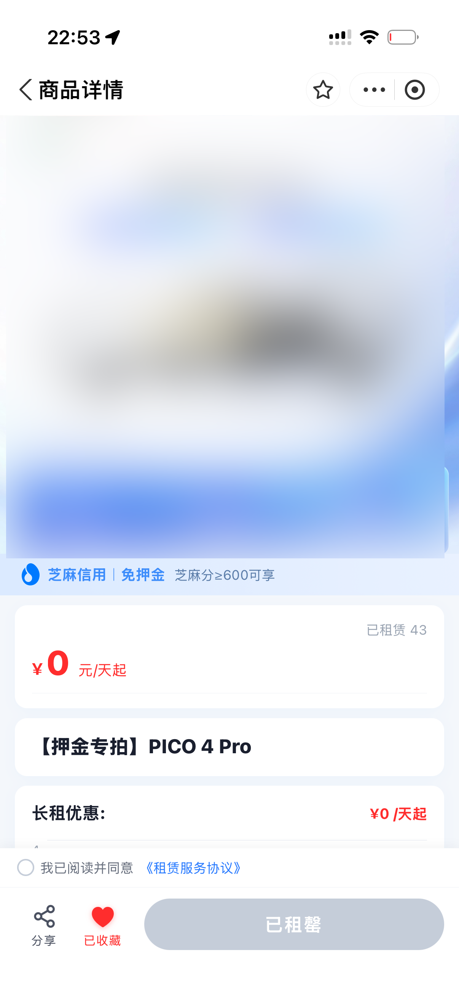
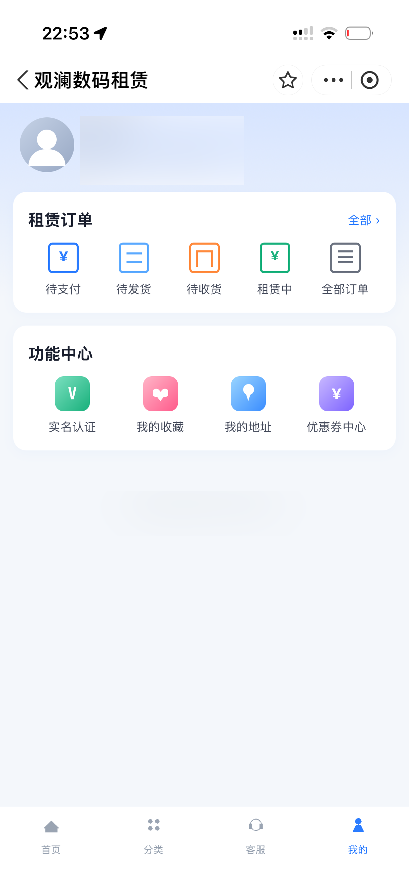
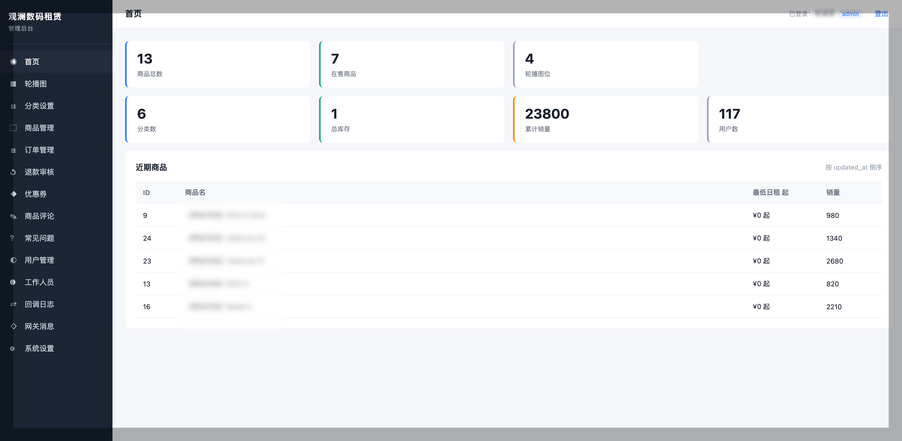
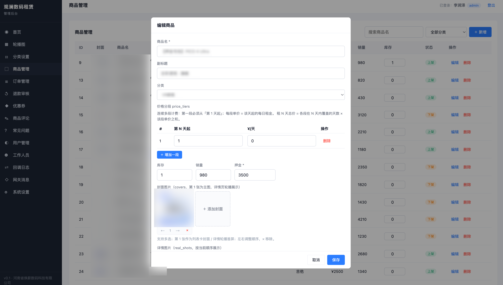
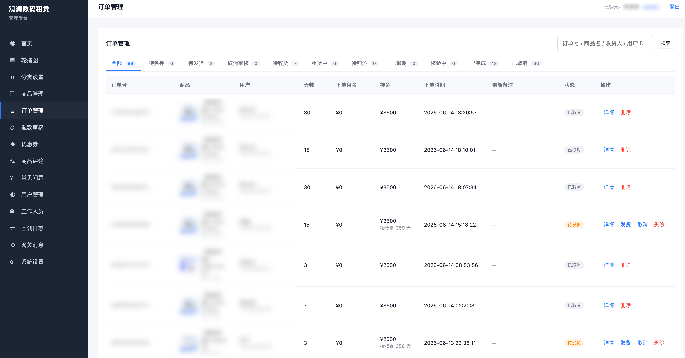
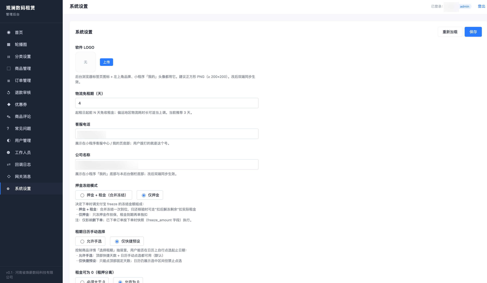

<div align="center">

# 支付宝信用免押 · 数码租赁小程序（全栈）

**支付宝小程序前端 + Python（Flask + SQLite）后端 + Vue 管理后台**
一套完整的「芝麻信用免押租赁」业务系统：实人认证、信用免押冻结、预授权扣款、订单履约同步、物流、优惠券、管理后台一应俱全。

[English](./README.en.md) · [许可协议](#-许可协议仅供学习禁止商用) · [商用授权](#-商用授权免费终身) · [代部署服务](#-代部署服务)

</div>

---

## ✨ 项目简介

这是一个面向「3C 数码 / 设备线上租赁」场景的支付宝小程序全栈项目，核心打通了支付宝开放平台的**芝麻信用免押**能力：

- 用户实名认证（实人 + 人脸）后，凭芝麻信用**免押金**下单；
- 商家通过**资金授权冻结 / 解冻**、**预授权转支付（扣租金、定损、逾期）**完成资金闭环；
- 订单全流程同步到**支付宝订单中心**（履约同步），物流、归还、验机自动流转。

> 本项目可作为学习「支付宝信用借还 / 免押租赁」接入的完整参考实现。

## 🖼 功能预览

### 📱 小程序前端（用户端）

<table>
  <tr>
    <td align="center"><br/><sub>首页 · Banner / 信任标签 / 商品流</sub></td>
    <td align="center"><br/><sub>分类检索 · 关键字搜索 + 侧栏分类</sub></td>
    <td align="center"><br/><sub>商品详情 · 芝麻信用免押 / 分段价</sub></td>
  </tr>
  <tr>
    <td align="center"><br/><sub>客服中心 · 在线客服 + 常见问题</sub></td>
    <td align="center"><br/><sub>我的 · 租赁订单 / 实名 / 优惠券</sub></td>
    <td></td>
  </tr>
</table>

### 🖥 管理后台（商家端 · Vue）

<table>
  <tr>
    <td align="center"><br/><sub>数据看板 · 商品 / 库存 / 销量 / 用户统计</sub></td>
    <td align="center"><br/><sub>商品管理 · 分段价 / 押金 / 多图封面</sub></td>
  </tr>
  <tr>
    <td align="center"><br/><sub>订单管理 · 待免押→发货→租赁→归还全流程</sub></td>
    <td align="center"><br/><sub>系统设置 · 免租期 / 冻结模式 / 客服信息</sub></td>
  </tr>
</table>

## 🧩 技术栈

| 层 | 技术 |
|---|---|
| 小程序前端 | 支付宝小程序原生（AXML / ACSS / JS） |
| 后端 | Python 3.11 · Flask · flask-cors |
| 存储 | SQLite（单文件，JSON payload 表结构） |
| 支付宝对接 | alipay-sdk-python · RSA2 验签 · AES 接口加密 |
| 管理后台 | Vue 3 + Vue Router（CDN / SFC 运行时编译，无需构建） |

## 📂 目录结构

```
.
├── qianduan/                  # 支付宝小程序前端
│   ├── app.json / app.js      # 小程序入口与全局配置
│   ├── mini.project.json      # 项目配置（appid 需自行填写）
│   ├── pages/                 # 各页面（首页/商品/下单/订单/实名/优惠券…）
│   └── utils/config.js        # 后端 API 基址（需改成自己的域名）
│
└── houdan/                    # Python 后端 + 管理后台
    ├── run.py                 # 启动入口
    ├── requirements.txt       # Python 依赖
    ├── rsa_keys/              # 支付宝密钥（.pem 已 gitignore，放置见目录内 README）
    ├── data/                  # 运行期数据（app.db 首次启动自动生成，已 gitignore）
    ├── docs/                  # 接入 / 部署 / 业务流程文档
    ├── manager/               # Vue 管理后台（静态资源）
    └── app/
        ├── config.py          # 支付宝接入核心配置（APPID / 域名 / SERVICE_ID 等）
        ├── settings.py        # 运营可配置项默认值
        ├── alipay_client.py   # 支付宝 SDK 封装（免押 / 扣款 / 同步 / 实名…）
        ├── storage/           # SQLite 持久层 + 种子数据
        └── routes/            # 各业务路由
```

## 🚀 快速开始

### 1. 后端

```bash
cd houdan
python3 -m venv .venv
source .venv/bin/activate
pip install -r requirements.txt
python run.py
```

默认监听 `http://0.0.0.0:8001`。首次启动会自动创建 `data/app.db` 并灌入种子数据。

- **管理后台**：浏览器打开 `http://127.0.0.1:8001/manager`
- **默认管理员账号**：`admin` / `admin888888` ——⚠️ **首次登录后请立即在「员工管理」里修改密码！**

### 2. 配置支付宝（必填）

| 配置项 | 位置 |
|---|---|
| 应用私钥 / 支付宝公钥（`.pem`） | `houdan/rsa_keys/`（见该目录 `README.md`） |
| APPID / SERVICE_ID / AES 密钥 / 回调域名 | `houdan/app/config.py` 的 `AlipayConfig` |
| 客服电话 / 公司名 / APPID（运营项） | 管理后台「设置」页，或 `houdan/app/settings.py` 默认值 |
| 异步通知 / 守约链接 / nginx 部署 | 见 `houdan/docs/DEPLOY_CALLBACK.md` |

### 3. 前端（小程序）

1. 用**支付宝小程序开发者工具**打开 `qianduan/` 目录；
2. 在 `qianduan/mini.project.json` 填入你的小程序 `appid`；
3. 在 `qianduan/utils/config.js` 把 `BASE_URL` 改成你的后端公网域名；
4. 编译预览。

> 更多接入细节见 `houdan/docs/`：`ALIPAY_INTEGRATION.md`、`IDENTITY_AND_CREDIT_FLOW.md`、`ORDER_CENTER_SYNC.md`、`DEPLOY_CALLBACK.md` 等。

## ⚠️ 安全与配置须知

本仓库已移除全部敏感信息，开源版本中以下内容均为**占位符，需自行替换**：

- 支付宝 `APP_ID`、`SERVICE_ID`、`AES_ENCRYPT_KEY`（均留空）
- 回调域名 `NOTIFY_BASE`（`your-domain.example.com`）、库存系统域名
- 客服电话（`400-000-0000`）、公司名称（占位）
- 管理员账号为演示弱口令，**务必修改**
- `rsa_keys/*.pem`、`data/*.db`、`data/*.json` 均已 `.gitignore`，不会被提交

---

## 📜 许可协议（仅供学习，禁止商用）

本项目采用 **[PolyForm Noncommercial License 1.0.0](./LICENSE)** 授权：

- ✅ **允许**：任何人出于**非商业目的**自由学习、研究、修改、二次开发、分发；
- ❌ **禁止**：任何**商业用途**（盈利性经营、对外付费服务、并入商业产品销售等）。

> PolyForm Noncommercial 是专为「源代码」设计的非商业许可，比 CC BY-NC 更贴合代码授权场景。
> 严格意义上它**不属于 OSI 认证的开源协议**（开源定义不允许限制商用领域），但允许自由学习与非商业使用。

## 💚 商用授权（免费 · 终身）

**如需将本项目用于商业用途，请通过微信联系作者，即可免费获取终身商用授权（不收费）。**

<div align="center">


**微信：饼干打孔李师傅（海南 · 海口）**
扫码添加，备注「商用授权」

</div>

## 🛠 代部署服务

不想自己折腾服务器 / 域名 / nginx / 支付宝配置？

**提供代部署服务：¥150 / 次**，含后端上线、HTTPS、支付宝回调配置联调，部署完成即可用。
通过上方微信联系即可。

---

## 免责声明

本项目仅供学习与技术交流。使用者需自行确保：合法持有支付宝商户资质、遵守支付宝开放平台协议与相关法律法规、妥善保管密钥与用户隐私数据。作者不对任何因使用本项目产生的后果负责。
